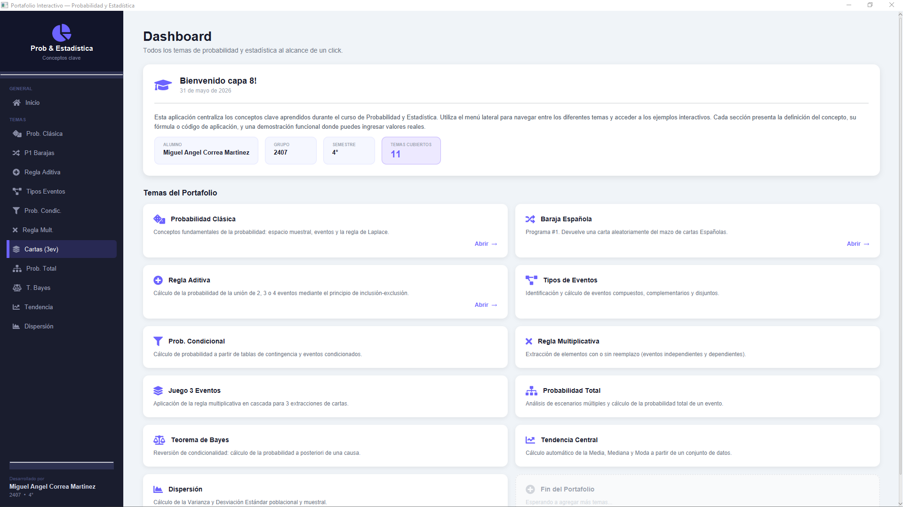
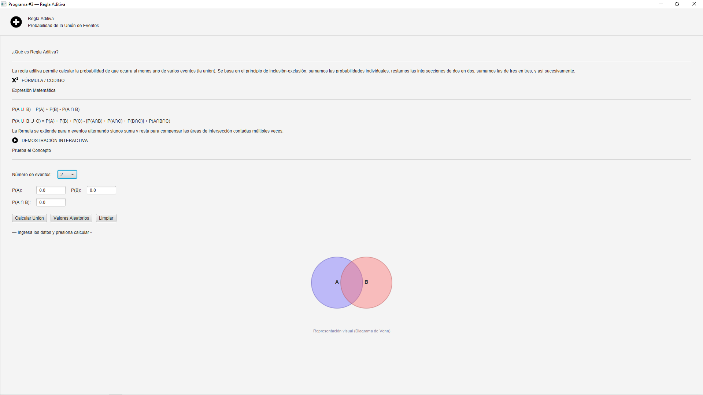
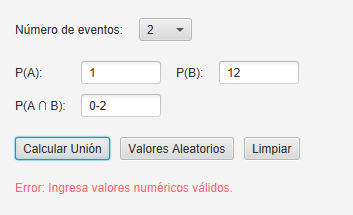
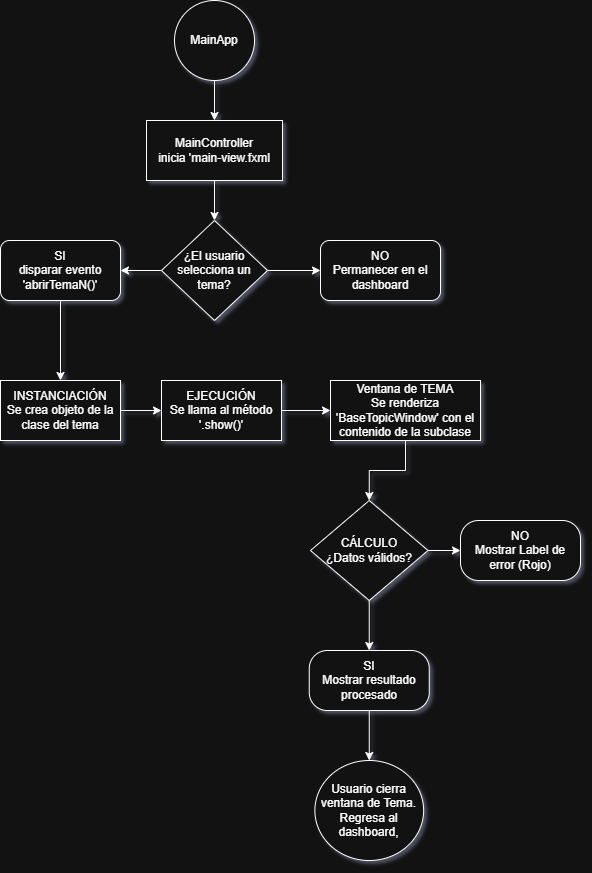

# Documentación del Portafolio de Probabilidad y Estadística

Este documento proporciona una guía detallada sobre el funcionamiento, estructura técnica y mantenimiento del Portafolio Interactivo.

---

## Instrucciones de Uso

### 1. Navegación Principal
Al iniciar la aplicación, serás recibido por el **Dashboard**. Tienes dos formas de navegar:
*   **Menú Lateral (Sidebar):** Ubicado a la izquierda, permite un acceso rápido y constante a cualquier tema sin importar en qué sección te encuentres. Los botones cambian de color para indicar la sección activa.
*   **Grid de Temas:** En el centro del Dashboard, encontrarás tarjetas interactivas. Al hacer clic en una tarjeta, se abrirá la ventana correspondiente al tema.

### 2. Ventanas de Temas
Cada tema se abre en una ventana independiente pero estilizada con la misma identidad visual:
*   **Lectura:** En la parte superior verás la definición teórica y la fórmula matemática.
*   **Interacción:** En la sección "Demostración Interactiva", podrás ingresar datos (números, selecciones de combo o series).
*   **Acción:** Usa los botones de **Calcular** para procesar los datos, **Valores Aleatorios** para pruebas rápidas o **Limpiar** para vaciar los campos.

---

## Capturas de Pantalla

### Vista del Dashboard Principal

### Ejemplo de Tema Interactivo (Regla Aditiva)

### Manejo de Alertas y Errores

---

## Diagrama de Flujo (Lógica del Menú)

---

## Diccionario de Funciones y Clases

| Clase / Componente | Descripción |
| :--- | :--- |
| **`MainApp`** | Punto de entrada del programa. Configura el escenario principal y carga los estilos CSS globales. |
| **`MainController`** | Gestiona la lógica de la vista principal. Controla la navegación, los estados de los botones y la actualización de los datos del alumno. |
| **`BaseTopicWindow`** | **Clase Maestra (Abstracta).** Define el esqueleto visual de todos los temas. Contiene la lógica para construir el header, la tarjeta de fórmula y el scroll de contenido. |
| **`ReglaAditiva`** | Implementa la unión de 2, 3 y 4 eventos con visualización de Diagramas de Venn. |
| **`TeoremaBayes`** | Clase que calcula probabilidades a posteriori basadas en la probabilidad total previa. |
| **`TendenciaCentral`** | Procesa arreglos de datos para extraer Media, Mediana y Moda. |
| **`buildDemoSection()`** | Método abstracto en la base que cada tema debe sobreescribir para crear su propia UI de demostración. |
| **`show()`** | Método de la clase base que instancia el `Stage` y hace visible la ventana del tema. |

---

## Manejo de Errores y Robustez

La aplicación está diseñada para ser "a prueba de fallos" del usuario (Crash-proof) mediante las siguientes estrategias:

1.  **Bloques Try-Catch:** Todos los métodos de cálculo (`calcular()`) están envueltos en bloques de manejo de excepciones. Si el usuario ingresa letras en un campo numérico o deja campos vacíos, el programa captura el `NumberFormatException` o `NullPointerException`.
2.  **Validación de Dominio:**
    *   Se verifica que las probabilidades no sean negativas ni mayores a 1 (cuando aplica).
    *   Se evita la división entre cero (ej. en probabilidad clásica si el espacio muestral es 0).
    *   En cálculos de series, se verifica que existan suficientes datos antes de procesar.
3.  **Feedback Visual:** En lugar de lanzar diálogos de error molestos (pop-ups), la aplicación utiliza un **Label de Error** dinámico en color rojo dentro de la misma ventana, permitiendo al usuario corregir el dato rápidamente.
4.  **Inputs Seguros:** Se utilizan `ComboBox` en lugar de campos de texto siempre que las opciones sean limitadas (como el número de eventos o tipo de mazo), reduciendo la posibilidad de error humano.
